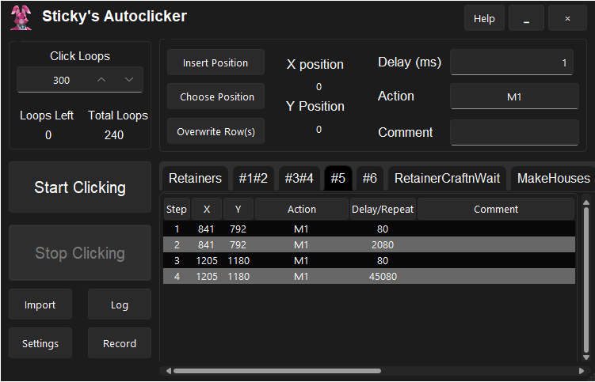
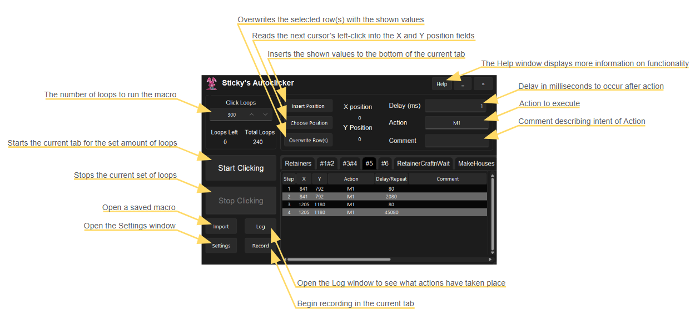

  <h1 align="center">Sticky's Autoclicker</h1>

  
A powerful autoclicker with infinite recursion!

  

<!-- TABLE OF CONTENTS -->

  
Table of Contents

  <ol>
    <li>
      <a href="#about-the-project">About The Project</a>
    </li>
    <li>
      <a href="#getting-started">Getting Started</a>
      <ul>
        <li><a href="#developer-setup">Developer Setup</a></li>
        <li><a href="#installation">Installation</a></li>
      </ul>
    </li>
    <li>
      <a href="#usage">Usage</a>
      <ul>
        <li><a href="#buttons">Buttons</a></li>
        <li><a href="#the-gui">The GUI</a></li>
        <li><a href="#clicks-and-keys">Clicks and Keys</a></li>
        <li><a href="#special-keys">Special Keys</a></li>
        <li><a href="#macros">Macros</a></li>
        <li><a href="#recording">Recording</a></li>
        <li><a href="#settings">Settings</a></li>
        <li><a href="#log-window">Log Window</a></li>
      </ul>
    </li>
    <li>
      <a href="#about-the-project">Known Issues</a>
    </li>
  </ol>

<!-- ABOUT THE PROJECT -->
## About The Project

Because clicking is hard and my fingers get tired I decided to write an autoclicker that can help automate repetitive processes.

Over the last few years my needs and laziness has grown and so this autoclicker's abilites have as well.

I hope many others can find this project useful in both their professional and gaming lives.

Download the latest release to 

(<a href="#readme-top">back to top</a>)

<!-- GETTING STARTED -->
## Getting Started

If you would like to build this locally it is quite easy to setup, just follow the below steps.

### Developer Setup

This program is only intended to be built and run on windows machines due to screenshotting, keyboard and mouse input and monitor recognition dependancies.

Python version 3.0 or greater required.

There are a fair number of dependencies needed to install before the python file will build. They can be found in the requirements.txt file and installed with the command: pip install -r requirements.txt

### Installation

Releases are built into a single file executable so nothing more is required then the file itself.

Necessary folders will be created if it your first time running the program. They are located in the C:\Users\Username\Documents\StickysAutoClicker\ folder.

(<a href="#readme-top">back to top</a>)

<!-- USAGE -->
## Usage

Sticky's Autoclicker is an autoclicker like many others but using rescursion with some classic python functionality it brings it's abilities to new heights.

Like most autoclickers it takes coordinates and mouse buttons or keys and will execute them in the given order with delays. But that's not all...

Read below to explore just how much it can do!

### Buttons

The **Insert Position** button will insert a new row at the bottom of the currently selected macro with the set values: X and Y positions, delay, action and comment.

The **Choose Position** button will set X and Y fields into search so they will reflect the cursors current postions on your monitors and will save the positions of your next left-click. This button does recognize multiple screens but can have trouble if you have more, less or re-arranged the screens since you setup the macro.

**Overwrite** will set all selected rows to the current X, Y, delay, action and comment values.

By right clicking in the macro steps table you can Close a macro tab, add a new macro, select all the rows, move the selected rows up or down, remove the selected rows or overwrite them with the specified values. Know that you can use Shift + click and Ctrl + click to select and edit multiple rows at a time! This is incredibly handy when needing to move one row up many times, you can instead select all the rows above that a new row should move past and move those down instead. That will push the bottom row up many rows at once!

### The GUI
The window itself is resizeable to accomodate larger and longer macros (sorry for the lag on resizing).
Columns in the table are resizeable in case your actions or comments are longer.
A sufficiently long macro will expand the vertical scrollbar so that the table can move up and down allowing all rows to be seen.
Once you've opened enough macros the tabs above the table will become scrollable so that you can have many open without losing access.
The macro tabs are draggable to allow you to keep them organized.

Once a macro start the running row is highlights in orange and the running tab is opened with a #TODO.

Upon closing the program it will save your open tabs and their order so that when the program is re-opened they are the same as when you left off.
It also saves the position of the window upon closing and will reopen to where it was before.
The amount in **Click Loops** is saved upon each change for each macro and loaded upon tab change. I found that macros varied greatly in the amount of loops I needed from them and I got tired of changing the Click Loops so often so I hope you find this as helpful as I do.

### Clicks and Keys
The three mouse clicks and all major keystrokes are recognized as valid **Action** inputs and will execute when specified.

The mouse wheel will be recognized when scolled while the cursor is hovering over the **Action** input and will increase or decrease as the wheel continues to scroll.

Numpad keys are logged differently as they often can have different functionality in applications.

**Action** will recognize the main three mouse clicks as well as any keyboard action including Shift + keys (doesn't work with Alt or Ctrl + keys).

Selecting any row of a macro will auto-populate the X and Y positions, delay, action and comment fields with the values of that row, overwriting anything previously entered.

Key presses do not move cursor, so X and Y positions do not matter.

The **Action** field has two escape characters, ! and #, that will allow the user to continue typing rather than overwriting the action key.
 - This is to allow for calling another macro (!) or finding an image (#)
   
Typing !macroName into **Action** and adding that row will make the row look for another macro with a name matching what follows the ! and execute that macro.
 - Delay serves another purpose when used with a macro action and the given macro will repeat that macro for the amount of times in the Delay column.
 - Macros do not need to be in a tab to be called by another macro. The .csv in the ~\StickyAutoClicker\Macros\ folder will be used if it exists.
   
Typing #imageName into **Action** and adding that row will make a macro look for a .png image with that name in the ~\StickyAutoClicker\Images\ folder and move the cursor to a found image and left click.
 - **Delay** will serve as the confidence percentage level when used with a find image action.
 - Confidence of 100 will find an exact match and confidence of 1 will find the first roughly similar image.
 - If image is not found then loop will end and next loop will start. This is to prevent the rest of the loop from going awry because the expected image was not found.
- Ending the #imageName in a ? will allow the finding of an image to be optional and not exsit the macro if not found. This allows for repeat attempts or alternate paths to be taken.
  
Action also allows underscore _ as a special character that will indicate the following key(s) should be pressed and held for the set amount of time in the **Delay** field.
- Note that for these rows the **Delay** no longer delays after the key is held but will instead hold the keys for the specified time.
 - You can hold multiple keys at a time by continuing to type into the **Action** field once a _ has been entered. A | (pipe) will delineate the different keys to be held.
        

### Macros
Macros are exported as .csv files that are written to folder ~\StickyAutoClicker\Macros\ in your Documents folder. 

Exported macro files are kept up to date with each edit created so no progress is ever lost.

Import expects a comma separated file with no headers and only five columns: X, Y, Action, Delay, and Comment. If you find it easier you can edit the csv files directly! Just be careful having the file open in the autoclicker at the same time as the program writes to the file each time a new macro tab is selected.

### Special Keys
Shift + LCtrl + ` will set loops to 0 and stop the autoclicker immediately.

Shift + LCtrl + Tab will pause the autoclicker and pressing that key combination again will start the autoclicker where it left off.
 - Remember you might need to focus back on the application to be clicked or key pressed before starting again.

### Recording
The Record functionality will begin entering rows to the end of the current macro tab reading key presses and delays.
 - This functionality is quite accurate (for python) and can be quite efficien especially when paired with manual edits to shorten or remove unnessecary delays or actions.
 - For playback of recordings it is highly recommended to use the Busy Wait option in the Settings menu.
 - Busy Wait allows the delay to be accurate to around one millisecond where as non-Busy Wait is accurate to around 10-15 ms.
 - The downside of Busy Wait and why it shouldn't always be used is that it incurs heavy CPU usage and can be felt by users and other programs.

### Settings
**Use Busy Wait** - Uses the CPU heavy busy wait for most accurate delay and key holds. Best to when you want to recreate the most accurate recording for consistency. 

**Start From Selected Row** - Will begin a macro from the first selected row. This is useful when a long macro messes up and you cannot start from the top and need to start midway through a macro.

**Application Selector** - Is in progress functionality intended to find an application's windows and then will apply a macro directly to that window. My hope was that it could run on windows not in focus or minimized but it appears this is nearly impossible for Python to do in Windows. (Please contact me if you know how to do this!)

**Stay On Top** - Forces the autoclicker to the foreground. When off this window will act like any other, allowing other windows to cover it up.

**Developer Mode** - Prints memory usage to Log Window upon opening.

**Use Hidden Mode** - (Currently removed) Is also in progress functionality that intends to allow the clicker to send clicks and keystrokes to applications without interrupting or commandeering you keyboard and mouse. This too is quite difficult to do in Python. 

**Loops By Macro** - Enables the program to save the amount of loops entered into Click Loops for each macro. It will then load that amount of loops each time a new macro tab is selected.

### Log Window
The log window is a necessity of debugging issues in complex macros.

The Log window logs:
 - Each click or key pressed and the following delay.
 - When images or files are not found.
 - When the Pause or Exit key combinations are pressed

(<a href="#readme-top">back to top</a>)

## Known Issues
I would like to get the accuracy or recording up as much as possible without having to rewrite everything in C. Contact me or submit a pull request if you know of any improvements that could be made to reduce delay between the expected delay and actual.

Numpad keys *, /, -, +, do not overwrite previous keys in Action as they should.

Resizing window is very laggy.

If you think Alt or Ctrl + keys would helpful as a valid action let me know and I try to get it done.

The running row is not immediately highlighted when return to the running tab.

(<a href="#readme-top">back to top</a>)

